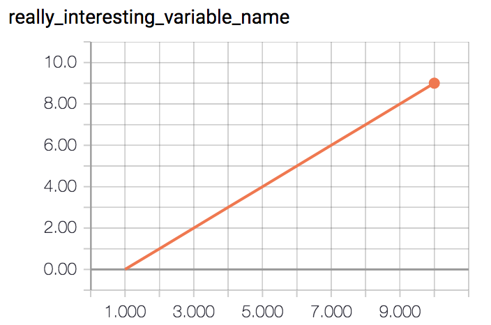

# Easy TensorFlow Logging

Are you prototyping something and want to be able to _magically_ graph some value
without going through all the usual steps to set up TensorFlow logging properly?

`easy_tf_log` is a simple module to do just that.

```
from easy_tf_log import tflog
```

then you can do

```
for i in range(10):
    tflog('really_interesting_variable_name', i)
```

and you'll find a directory `logs` that you can point TensorBoard to

`$ tensorboard --logdir logs`

to get



Based on logging code from OpenAI's [baselines](https://github.com/openai/baselines).

## Installation

For TensorFlow without GPU support:

`pip install git+https://github.com/mrahtz/easy-tf-log#egg=easy-tf-log[tf]`

For TensorFlow *with* GPU support:

`pip install git+https://github.com/mrahtz/easy-tf-log#egg=easy-tf-log[tf_gpu]`

## Usage

On import, `easy_tf_log` sets up a logger saving to a directory `logs`. To
change the directory it logs to, call `easy_tf_log.set_dir(log_dir)`.

`tflog(key, value)`: log `value` with name `key`.

See [`demo.py`](demo.py) for a full demo.

## Tests

Tests are in `tests.py`. CircleCI status:  
[](https://circleci.com/gh/mrahtz/easy-tf-log/tree/master)
